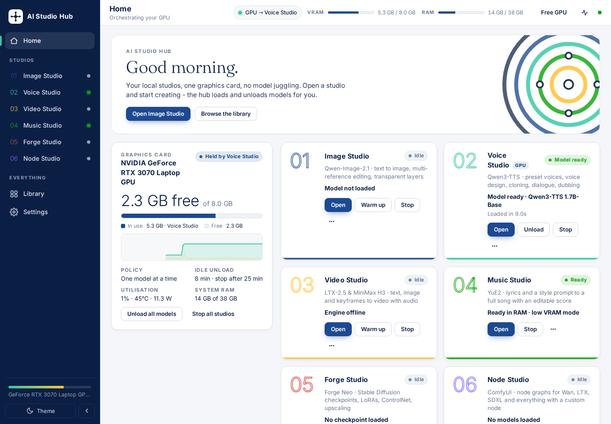
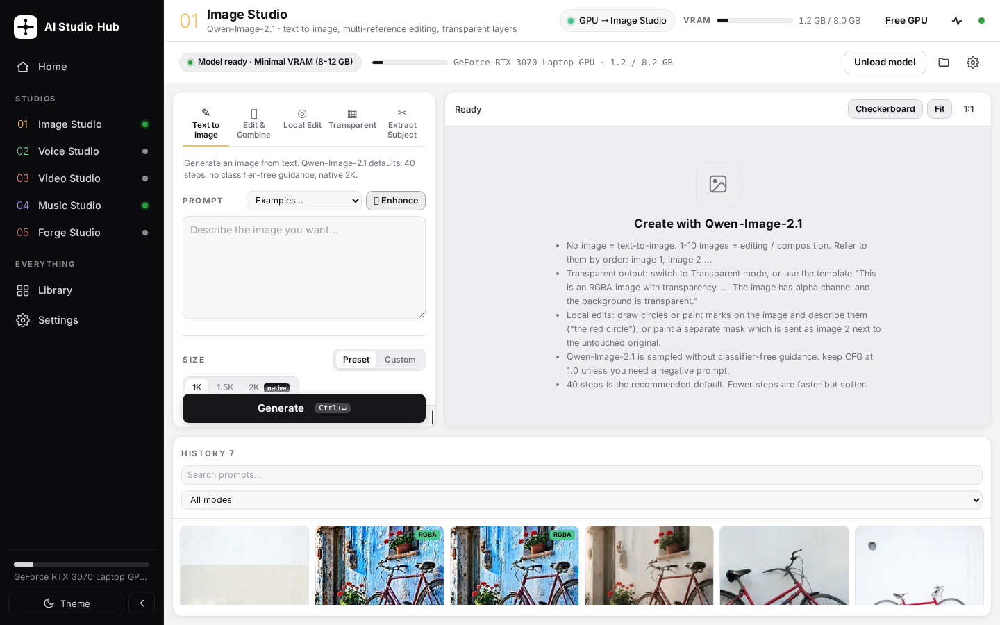
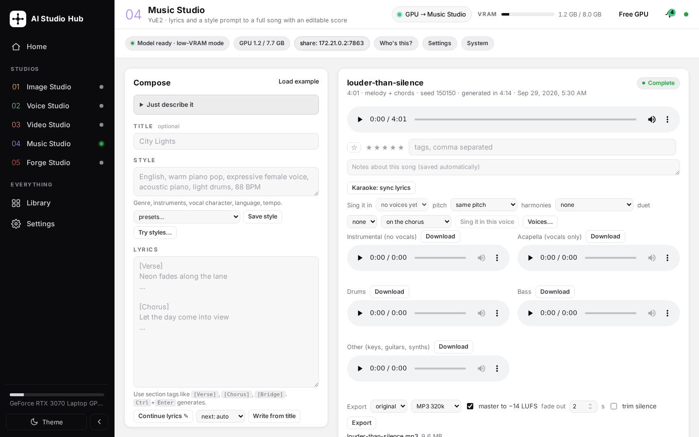
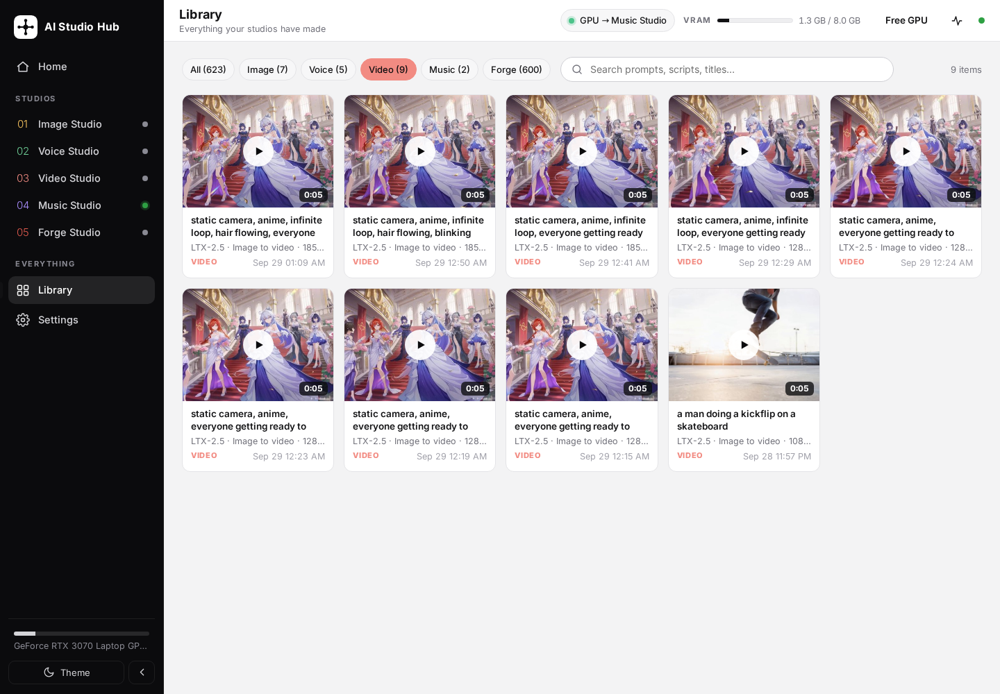
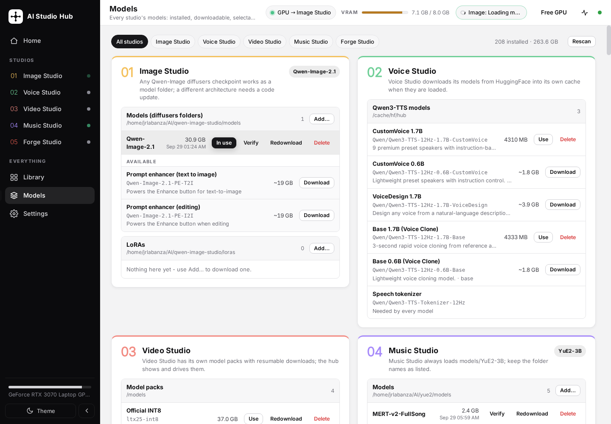
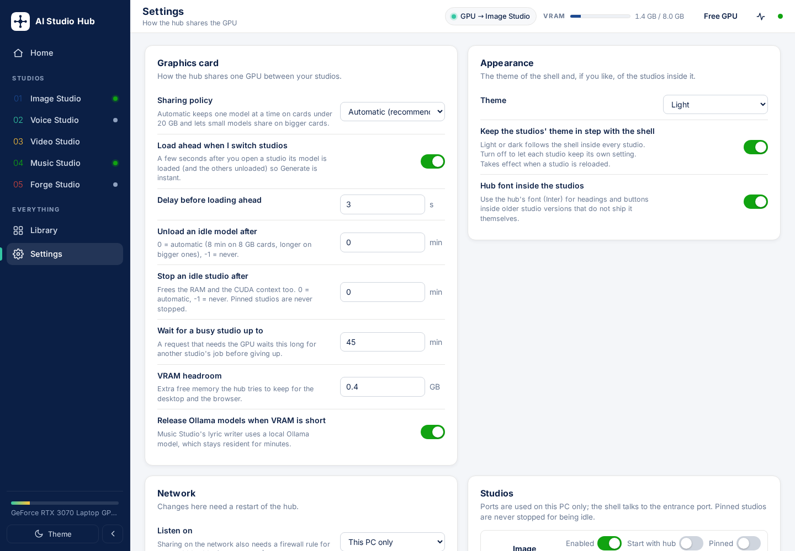

# AI Studio Hub

One home for your local AI tools — image, voice, video, music and Forge — with a GPU **auto-loader** that
keeps an 8 GB card (or any card) working instead of running out of memory.

The hub starts each tool on demand in its own environment, puts a themed entrance in front of it, shares the GPU
between them, and gathers everything they make into one library. The tools themselves are **not modified**.

| # | Studio | Tool | Repository |
|---|---|---|---|
| 01 | **Image Studio** | Qwen Image Studio — Qwen-Image-2.1 text-to-image, editing, transparent layers | [jrlabanza/qwen-image-studio](https://github.com/jrlabanza/qwen-image-studio) |
| 02 | **Voice Studio** | Text To Speech generator — Qwen3-TTS preset voices, voice design, cloning, dubbing | [jrlabanza/tts-generator](https://github.com/jrlabanza/tts-generator) |
| 03 | **Video Studio** | Lumen Video Studio — LTX-2.5 and MiniMax H3 video with audio | [jrlabanza/video-generator](https://github.com/jrlabanza/video-generator) |
| 04 | **Music Studio** | Music Gen Studio — YuE2 songs from lyrics with an editable score | [jrlabanza/music-generator](https://github.com/jrlabanza/music-generator) |
| 05 | **Forge Studio** *(optional)* | Forge Neo — the Jrlabanza Image Generator build of Stable Diffusion WebUI Forge | [jrlabanza/jrlabanza-image-generator-core](https://github.com/jrlabanza/jrlabanza-image-generator-core) |

All five are git submodules of this repository, pinned to tested versions. Forge is *optional*: its repository is
private (collaborators only), and a clone that cannot fetch it still runs with the four others - the hub leaves a
studio out of the shell when its folder is empty, and also picks up a checkout that sits *next to* the hub folder.

Runs on **Windows** (each tool in its own Python environment) and on **Linux** (each tool in its own Docker
container, the `linux/` packaging every studio ships).

## What it looks like



*Home: live VRAM, the studios with their model state, and the activity feed. Every studio shares the same design
language ([docs/design.md](docs/design.md)) and opens inside the shell - here Image Studio with the GPU handed to it,
and Music Studio:*





*Library: everything the studios have made, in one grid (filtered to videos here):*



*Models: every studio's models in one place - installed, downloadable, selectable:*



*Settings: the GPU policy and timers, and one row per studio:*



## Quick start (Windows)

1. Clone the hub **with the studios** (they are git submodules, pinned to tested versions):

   ```
   git clone --recurse-submodules https://github.com/jrlabanza/ai-studio-hub.git
   ```

   Already cloned without them? `git submodule update --init --recursive` fetches them (`--recursive` also brings the
   upstream YuE repository that Music Studio embeds). Without access to the private Forge repository, initialise the
   others by name: `git submodule update --init --recursive "Image gen" "qwen tts" video-gen Yue2`.
2. Set each studio up once with its own script: `Image gen\Initialize.bat`, `qwen tts\initialize.bat`,
   `video-gen\initialize.bat`, `Yue2\initialize.bat`, `forge\initialize.bat`. They create their own Python environments
   and download their models.
3. Double-click **`Initialize AI Studio Hub.bat`** once. It creates a small `.venv` for the hub (FastAPI, uvicorn, httpx,
   websockets, psutil, Pillow — no PyTorch, no models).
4. Double-click **`Start AI Studio Hub.bat`**. The browser opens `http://127.0.0.1:7900`. Close the window to stop the hub
   *and* every studio it started.

Nothing starts until you need it: opening a studio starts it, pressing Generate loads its model.

## Quick start (Linux)

On Linux the studios are the Docker-packaged checkouts of the same repositories: every one has a `linux/` directory
(Dockerfile, `compose.yml`, `run.sh`, `stop.sh`, `initialize.sh`) and its own image `ai/<tool>:latest`. The hub finds
them **inside its folder** (the submodule layout) or **next to it** under any of their usual names — so the `~/AI`
layout used with [jrlabanza/ai-launcher](https://github.com/jrlabanza/ai-launcher) works as it is:

```
~/AI/
  ai-studio-hub/        this repo
  qwen-image-studio/    Image Studio      (ai/qwen-image)
  qwen-tts/             Voice Studio      (ai/qwen-tts + ai/chatterbox)
  video-generator/      Video Studio      (ai/video)
  yue2/                 Music Studio      (ai/yue2)
  forge/                Forge Studio      (ai/forge)
```

1. Set the studios up once with their own `linux/initialize.sh` (driver check, Docker with the NVIDIA toolkit or the AMD device groups, the CUDA or ROCm image,
   models) — or `ai init <tool>` with the AI Launcher.
2. Run **`./Initialize AI Studio Hub.sh`** once (the same as `linux/initialize.sh`): it creates the hub's `.venv`, lists
   which studios it found and adds an app-menu entry, **AI – Studio Hub**.
3. Run **`./Start AI Studio Hub.sh`** (or `linux/run.sh`, or `ai run hub`). The browser opens `http://127.0.0.1:7900`.
   Ctrl+C or closing the window stops the hub and every container it started; `linux/stop.sh` does the same from
   elsewhere. `linux/run.sh --background` starts it detached, `linux/test.sh` checks the environment and does a real boot.

How the container path differs from the tools' own `run.sh`:

* The hub runs `docker compose up` itself (attached, so the container log streams into the hub) and **not**
  `run.sh`, because `run.sh` stops every other tool first — on an 8 GB card the hub prefers to *unload models* and
  only stops a container when the card is still too full. Several studios can therefore be up at once with their
  models unloaded (each idle container pins a few hundred MB of CUDA context, which the idle-stop timer reclaims).
* The hub's own additions to a studio's compose file live in `hub/compose/<service>.yml` and are merged with
  `-f`: Image Studio starts with `--no-autoload` and Voice Studio without `--preload`, so no model touches the GPU
  before the hub hands it over. The studios' `linux/` packaging is never edited.
* Container ports are fixed by the compose files (7864, 7861, 8765, 7863, 7860); the entrances on 7901–7905 and
  the hub on 7900 are the same as on Windows.
* A container started by hand (`ai run <tool>`) is taken over rather than duplicated; a container stopped by hand
  (`ai stop <tool>`) is shown as stopped, not as an error. Chatterbox comes up with Voice Studio when its image exists
  (Settings → Studios → Chatterbox).
* Forge loads its last checkpoint the moment its UI opens (its own behaviour). That request travels through Gradio's
  queue, which the hub treats as a GPU claim, so the other studios are unloaded first; and should a studio ever come
  up holding a model while another one owns the GPU, the hub unloads it again straight away.

## GPU support: NVIDIA and AMD

| | NVIDIA | AMD |
|---|---|---|
| Windows | tested (CUDA 12.6 / 13) | implemented through AMD's native PyTorch-on-ROCm wheels (ROCm 7.14, Radeon RX 7000 / RX 9000, RX 6800 and up, Ryzen AI APUs) - **awaiting verification on AMD hardware** |
| Linux | tested (Docker, CUDA) | implemented: every studio has a second, ROCm container (`ai/<tool>:rocm`, built from `linux/Dockerfile.rocm` with the official PyTorch ROCm wheels) that the launcher and the hub pick automatically on an AMD box - **awaiting verification on AMD hardware** |

Every studio's initialiser detects the card once, installs the matching PyTorch build and writes what it
chose to `.gpu.json`; launchers and the apps read that file to switch off the features that only exist for
the other vendor (NF4 quantisation, SageAttention, CUDA graphs, pinned-memory tricks). The hub reads the card
through `nvidia-smi`, `rocm-smi`/`amd-smi` or the Windows GPU performance counters, whichever exists, and its
check-up page shows which vendor each studio was set up for. [docs/gpu.md](docs/gpu.md) is the contract and
the per-studio detail.

**Pinned memory.** Settings → Graphics card → *Pinned memory in the studios* sets `AI_PIN_MEMORY=1|0` for
every studio the hub starts. Page-locked host RAM makes the CPU↔GPU weight transfers of the offload modes
faster (Image Studio's offload profiles, Music Studio's low-VRAM swap, Forge's `--pin-shared-memory`,
Video Studio's engine); each studio reads the variable, defaults to on for CUDA and off for ROCm, and has
its own toggle that overrides the hub. Turn it off when RAM is short - pinned memory cannot be swapped out.

## How the auto-loader works

Every request that needs the GPU (Generate, Enhance, Load model, Start engine, Sing, Transcribe, a Forge txt2img …) passes through the hub first. Before forwarding it the hub:

1. **waits** if another studio is still rendering — no job is ever interrupted, your request is queued and starts by itself;
2. **unloads** the other studios' models (Qwen-Image, Qwen3-TTS + Whisper + Chatterbox, the ComfyUI engine, Forge's
   checkpoint);
3. measures the free VRAM (`nvidia-smi`, `rocm-smi` or the Windows GPU counters); if the card is still too full it **stops** the other studios' processes (an idle
   process still pins a few hundred MB of CUDA context — that matters on 8 GB) and asks a local **Ollama** to drop its models;
4. hands the GPU over and lets the studio load what it needs (queueing a model load ahead of the request where the tool
   does not do that itself).

Two policies, chosen automatically from the card:

| Card | Policy | Meaning |
|---|---|---|
| under 20 GB (8 / 12 / 16 GB) | **one model at a time** | strictly one studio holds the GPU; the others are unloaded and, if needed, stopped |
| 20 GB and up | **share when it fits** | small models (a 1.7B TTS model, YuE2) may stay resident next to each other as long as the measured free memory allows |

Also built in:

* **Load ahead** — a few seconds after you switch to a studio, its model is loaded and the previous one unloaded, so Generate is instant (Settings → Graphics card; off if you prefer).
* **Idle unload / idle stop** — models are unloaded after 8 minutes idle on an 8 GB card (15 / 30 on bigger ones) and idle studios are stopped later to free RAM. Pin a studio to keep it running.
* **Free GPU** — unload everything at once (for a game, another app, or peace of mind).
* Everything the hub does is listed under **Activity**: what was unloaded, stopped and how much memory came free.

## The shell

* **Home** — the card's live VRAM, a sparkline, the studios with their model state, running jobs with progress, and the recent activity.
* **Studios** — each tool runs inside the shell (Alt+1 … Alt+5). Every studio implements the same design language natively (see [docs/design.md](docs/design.md)), so it looks the same on its own and inside the hub; the shell only keeps the studio's light/dark theme in step with its own (Settings → Appearance) and hides the studio's own top-bar branding, since the shell shows its name.
* **Library** — every image, clip, video and song the studios have ever made, in one searchable grid with a viewer, downloads and "open folder".
* **Send to…** — from the Library viewer, hand any output straight to another studio: an image becomes the start frame in Video Studio or a reference in Image Studio's Edit & Combine, a voice clip becomes the reference voice for Music Studio's "sing it in this voice", a song goes to Voice Studio's speech-to-speech, a video to its dubbing. No download, no upload: the hub opens the target studio, waits for it, and drops the file into the slot you chose ([docs/handoff.md](docs/handoff.md) lists every slot and the small receiver each studio implements). It reads the tools' output folders directly (Forge's prompts come from the PNG metadata), so it works even when a studio is off.
* **Models** — one page for every studio's models: what is installed (with sizes and dates), the catalogue each studio was built around, and which model is in use. Download from HuggingFace, Civitai or a direct link straight into the right folder (resumable, checksum-verified, with a live Downloads panel), verify or redownload an installed model, delete it, or press **Use** to switch a studio to it - the hub frees the GPU first. Voice and Video Studio keep their own catalogues and the hub drives them ([docs/models.md](docs/models.md)).
* **Settings** — GPU policy and timers, pinned memory, appearance, network, HuggingFace / Civitai tokens, per-studio folders / ports / autostart / pinning, and a check-up of what is installed.
* Light and dark themes; the theme is applied inside the studios too.

## Moved a tool folder? The hub repairs it

Tools store absolute paths. When you move a tool folder the hub fixes, on the tool's next start, what would otherwise
break: a stale `model_path` in Qwen Image Studio's `settings.json`, and stale "editable" installs (`pip install -e`) of
`qwen_tts` and `yue2_infer`, whose recorded source folders are pointed back at the moved folder. It also sets Lumen's
`engine_autostart` to `false` so the video engine only takes the GPU when a video is rendered. These are the only files the
hub writes inside the tool folders.

## Ports

| Service | Port | Notes |
|---|---|---|
| Hub / shell | 7900 | `--port N` or Settings → Network |
| Image Studio entrance | 7901 | proxies the backend on 7970 (Windows) / 7864 (Linux container) |
| Voice Studio entrance | 7902 | proxies the backend on 7861 (+ Chatterbox helper 7862) |
| Video Studio entrance | 7903 | proxies the backend on 8765 (ComfyUI engine 8188 stays internal) |
| Music Studio entrance | 7904 | proxies the backend on 7860 (Windows) / 7863 (Linux container) |
| Forge Studio entrance | 7905 | proxies the backend on 7866 (Windows) / 7860 (Linux container) |

If a port is busy the hub moves to the next free one and prints the addresses in its window. A studio you started by hand
with its own launcher is adopted instead of started twice. Starting the hub twice opens the running copy.

### Sharing on your network

Settings → Network → *Everyone on my network* (or `--host 0.0.0.0`), restart the hub, then allow the ports once.
Windows, from an **administrator** PowerShell:

```powershell
New-NetFirewallRule -DisplayName "AI Studio Hub" -Direction Inbound -Protocol TCP -LocalPort 7900-7905 -Action Allow -Profile Any
```

Linux with ufw: `sudo ufw allow 7900:7905/tcp`. Anyone on the network can then use every studio without a password
(the tools see the hub as a local visitor), so keep it to networks you trust.

## How it is built

```
Start AI Studio Hub.bat / .sh        start the hub (accepts --port, --host, --no-browser)
Initialize AI Studio Hub.bat / .sh   one-time setup of the hub's .venv
linux\                run.sh, stop.sh, initialize.sh, test.sh, install-desktop.sh - the same packaging
                      shape as the studios' linux/ folders, so `ai run|stop|init|test hub` work too
hub\
  run.py            entry point: one uvicorn server on the hub port plus one port per studio
  main.py           the shell, its JSON API (/api/docs) and the live event stream
  proxy.py          per-studio reverse proxy: theme injection, GPU-route interception, lazy start, WebSocket pass-through
  orchestrator.py   the auto-loader: claims, waiting, unloading, escalation, idle policies
  process.py        the studio processes: native (.venv) and docker backends, health checks, logs, adoption
  docker.py         docker / docker compose helpers for the Linux packaging
  tools.py          everything the hub knows about each studio
  library.py        the unified library (reads the tools' output folders and indexes)
  gpu.py            GPU telemetry: nvidia-smi, rocm-smi / amd-smi, Windows GPU counters; psutil
  compose\          the hub's compose overrides (start-idle switches) merged with the studios' compose files on Linux
  web\              the shell (no build step) and the theme files injected into the studios
data\               settings.json, logs\<tool>.log, thumbs\, hub.pid   (created on first start)
```

Requires Python 3.10+ and an NVIDIA GPU (driver with `nvidia-smi`) or an AMD Radeon GPU (see GPU support above). Windows 10/11 needs the `py`
launcher; Linux needs Docker plus the NVIDIA Container Toolkit (NVIDIA) or the `video`/`render` groups (AMD) - any studio's `linux/initialize.sh` sets this up - and
`python3-venv`.

## License

MIT — see [LICENSE](LICENSE). The tools and their models keep their own licenses.

## Assistant (every studio)

**Assistant** in the sidebar: describe an image in plain words ("a cheerful fairy serving matcha in a tea house,
anime style", "Anby Demara at the beach at sunset"). A local language model (Qwen3 4B through Ollama, in its own
`ai-assistant-llm` container) plans it from what is installed - checkpoint, LoRAs and weights, a prompt in the
checkpoint family's format - you check or edit the plan, and Forge renders it. Ask for changes in your own words.

* **Skills belong to the studios:** each studio repo keeps `assistant/skills/*.md`; the assistant loads only the
  driving studio's skills (Forge: its model families; Video Studio, in phase 2: LTX-2.5 and MiniMax H3 only).
* **GPU handling (Planner: Auto):** the planner runs on the GPU when it is free - an idle studio holding it is unloaded
  first - and on the CPU while a studio is rendering; it is always unloaded before a render, so the studio gets the
  GPU. Measured on an 8 GB RTX 3070 laptop: a plan in about 4-8 s on the GPU (two short model calls), about 25-60 s on
  the CPU; a 1024x1344 render in Forge about 26-28 s.
* **Guard rails in code, not left to the small model:** only installed checkpoints and LoRAs, LoRAs compatible with the
  checkpoint's base model, a character LoRA only when you name that character (series names such as "Genshin" do not
  count), the checkpoint follows a named character's LoRA, Anima / Animagine only when you name them, trigger words
  added, negations moved to the negative prompt, "no people" becomes scenery.
* **Video Studio (phase 2):** pick *Video Studio* above the chat and describe a clip. **Engine** (next to Planner):
  *Auto*, *MiniMax H3* or *LTX-2.5* - a fixed choice plans every clip for that engine; the plan card's Engine switch
  re-plans the same clip for the other one (the two need differently written prompts). On Auto the planner chooses the engine
  (MiniMax H3 for speech, singing, acting and anime; LTX-2.5 for cinematic footage and anything over 15 s), the mode,
  length and orientation, and writes the prompt in that engine's format - for H3 the model fills the scene, the spoken
  lines, the soundscape and the music separately and the code builds H3's three-field format with the
  `(S1) says: <d>[English] ...</d>` dialogue tags. Video Studio's own skills (general + H3 + LTX-2.5) are the only ones
  loaded. **Chaining:** after a Forge image in the same conversation, "animate it" plans an image-to-video clip with that
  image as the first frame (the planner is given the tags the image was made from). Measured: plan 5-8 s on the GPU;
  Forge image 26 s, then a 5 s H3 image-to-video clip with a spoken line in about 240 s. Conversations survive a hub
  restart; the model's raw replies of the last plan are in `data/assistant/last-*.json`.
* **Image Studio, Music Studio, Voice Studio (phase 3)** - each with its own skills in its own repo:
  * *Image Studio* (Qwen-Image 2.1): text to image, **edit** the conversation's latest image ("edit it: make it a night
    scene" - the planner writes one short instruction; a full re-description would change nothing), transparent
    images (subject only, no background words). Text to print goes in quotes; text you did not ask for is removed.
    Measured: a 3:4 poster with readable lettering in 127 s; an edit in about 220-240 s.
  * *Music Studio* (YuE2): title, a style line (language, genre, vocal, instruments, mood, BPM) and lyrics with YuE's
    section tags (normalised to [Verse] / [Chorus] / ...), or an instrumental. Measured: an 81 s lo-fi instrumental in 117 s.
  * *Voice Studio* (Qwen3-TTS): a cast and a script - each voice designed from your words ("a calm British narrator"),
    a built-in speaker only when you name one, or a saved voice; stage directions such as *yawns* are removed, a
    requested accent is kept and an invented one dropped. Measured: one line in 18 s, a 6-line two-voice dialogue in 27 s.
* **Auto (the default chip) - the assistant picks the studio.** Clear words route in code (a song -> Music Studio,
  "say/narrate" -> Voice Studio, a clip -> Video Studio, a poster / logo / text / edit -> Image Studio, any other
  picture -> Forge; a follow-up stays with the current studio); only an unclear request is put to the planner model.
  The plan's first line says where it went and why.
* **Productions (Auto): "an anime opening", "a music video about ...", "a video with its own song".** One request
  becomes three steps that run in order in the background, one studio on the GPU at a time:
  1. **Key frame** - Forge (default anime checkpoint) for anime / illustrated looks, Image Studio otherwise. Only
     LoRAs of characters you name are used.
  2. **Song** - Music Studio; an anime opening defaults to an energetic J-pop / J-rock theme, about a minute long.
  3. **Video** - planned once the song exists: Music Studio's karaoke sync times the lyrics, the window is the first
     chorus (or the first sung line / the start), it is cut into shots along the lyric lines (2-7.5 s each), the
     planner writes each shot's action and the code builds MiniMax H3's trained layout: shot 1 opens on the key frame
     (image to video), shots with the character use it as `<Picture 1>` (reference generation) so it stays the same
     character, scenery shots are text to video. The song is the soundtrack, cut to the window, with its timed lyrics.

  It stops for your OK after the key frame, after the song and after the shots are written (read or edit each shot's
  prompt), unless *Run without stopping* is ticked. Every step has *Re-roll* (the steps after it are redone too); a
  failed step can be retried; the page shows the running production again when you come back, and a hub restart marks
  the interrupted step as retryable. Measured on the 8 GB RTX 3070 laptop ("i want to create an anime opening"): plan
  16-40 s on the GPU; key frame 47 s; a 62.8 s song 72 s; lyric timing and 5 shots 24 s; the 31.5 s, 5-shot MiniMax H3 storyboard (736x544, *fast*, turbo) 1257 s - about 23 minutes from request to
  video. The soundtrack check matched the song at 0.995.
* **RAM is part of the GPU hand-over.** An idle studio that was only unloaded keeps its process and often its model in
  RAM; MiniMax H3 needs about 18 GB RSS plus about 9 GB of pinned memory, and with idle Forge + Music Studio alive the
  kernel's OOM killer stopped the render (the earlier "Cannot connect to host 127.0.0.1:8188" storyboard failures).
  A studio can declare `ram_need_gb` (Video Studio: 32 - the finished render peaked at 36.4 of 38.4 GB used with
  every other studio stopped); before it gets the GPU the hub stops idle, unpinned studios,
  least recently used first, until the RAM fits.
* **Skills are the assistant's only.** The studios' own pages and their built-in helpers (Forge's ModelProfile and
  prompt enhancer, Video Studio's Enhance, Music Studio's lyric writer) do not read them.
